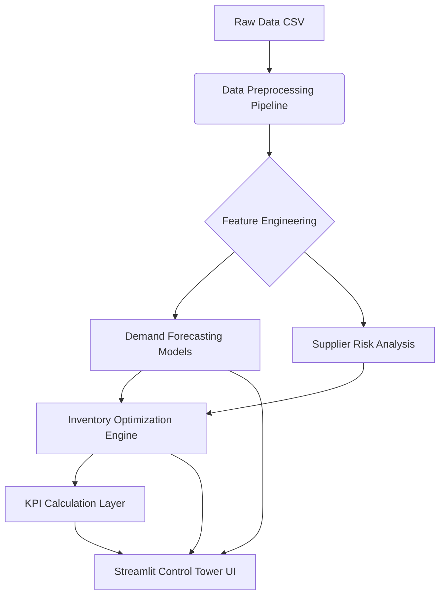

# AI-Driven Supply Chain Control Tower - System Blueprint

## 1. Project Objectives & Business Problem Definition

**Objective:** Build an end-to-end AI-driven Supply Chain Control Tower to optimize inventory, forecast demand, and mitigate supply chain risks.
**Business Problem:**

- **Demand Uncertainty:** Inaccurate forecasts lead to stockouts (lost sales) or overstocking (high holding costs).
- **Supply Disruptions:** Variability in supplier lead times causes production/fulfillment delays.
- **Lack of Visibility:** Disconnected data silos prevent real-time decision-making.
- **Inefficient Inventory:** Static reorder points fail to adapt to dynamic market conditions.

**Goal:** actionable insights to improve **OTIF (On-Time In-Full)**, reduce **Inventory Carrying Costs**, and maximize **Revenue**.

---

## 2. Dataset Understanding

**Source:** `./data/high_dim_supply_chain.csv`

### Detected Columns & Semantics

| Column Name | Type | Description | Role |
| :--- | :--- | :--- | :--- |
| `Date` | Date | Transaction date | Temporal Index |
| `SKU_ID` | Categorical | Unique Product Identifier | Key Dimension |
| `Warehouse_ID` | Categorical | Warehouse Location ID | Key Dimension |
| `Supplier_ID` | Categorical | Supplier Identifier | Key Dimension |
| `Region` | Categorical | Geographic Region (North, South, etc.) | Feature |
| `Units_Sold` | Numeric | Actual historical demand | **Target Variable** |
| `Inventory_Level` | Numeric | Current stock on hand | State Variable |
| `Supplier_Lead_Time_Days` | Numeric | Days to receive order from supplier | Feature / Risk Metric |
| `Reorder_Point` | Numeric | Inventory level triggering replenishment | Optimization Parameter |
| `Order_Quantity` | Numeric | Quantity ordered from supplier | Action Variable |
| `Unit_Cost` | Numeric | Cost to acquire one unit | Financial Metric |
| `Unit_Price` | Numeric | Selling price of one unit | Financial Metric |
| `Promotion_Flag` | Binary | 1 if item is on promotion, 0 otherwise | Feature |
| `Stockout_Flag` | Binary | 1 if stockout occurred, 0 otherwise | Risk Event |
| `Demand_Forecast` | Numeric | Existing/Legacy forecast value | Baseline for Comparison |

**Target for ML:** `Units_Sold` (Future Demand)
**Key Drivers:** `Promotion_Flag`, `Region`, `Unit_Price`, `Seasonality (derived from Date)`

---

## 3. Mapping to SCOR Model

The Supply Chain Operations Reference (SCOR) model alignment:

- **PLAN:** Demand Forecasting (ML Models), Scenario Planning.
- **SOURCE:** Supplier Reliability Scoring, Lead Time Prediction.
- **MAKE:** (Not explicitly covered by dataset, inferred via Inventory/Lead Time).
- **DELIVER:** Inventory Optimization, Stockout Prevention, OTIF analysis.
- **ENABLE:** Control Tower Dashboard, KPI Monitoring, Data Visualization.

---

## 4. Features & Modules to Build

### A. Demand Forecasting Engine

- **Goal:** Predict `Units_Sold` for next 7-30 days.
- **Models:**
  - **Baseline:** Moving Average / Exponential Smoothing.
  - **ML Models:** XGBoost / LightGBM (handling promotions, prices).
  - **Deep Learning:** LSTM or Prophet (if time-series complexity warrants).
- **Comparison:** Compare ML predictions vs. existing `Demand_Forecast` column.

### B. Inventory Optimization Module

- **Safety Stock Calculation:** Dynamic calculation based on demand variability and lead time variability.
- **Reorder Point (ROP):** `ROP = (Avg Daily Demand * Avg Lead Time) + Safety Stock`.
- **EOQ (Economic Order Quantity):** Optimize `Order_Quantity` to minimize total cost.
- **Days of Supply (DoS):** `Inventory_Level / Avg Daily Demand`.

### C. Supplier Risk & Reliability

- **Lead Time Variability:** Analyze `Supplier_Lead_Time_Days` variance.
- **Reliability Score:** Score suppliers based on consistency and stockout correlation.

### D. KPI Dashboard (The "Control Tower")

- **OTIF (On-Time In-Full):** Proxy using Stockout flags and Lead Times.
- **Fill Rate:** % of demand met from immediate stock.
- **Inventory Turnover:** `Cost of Goods Sold / Avg Inventory Value`.
- **Perfect Order Index:** Composite score of reliability.

### E. Scenario Planning / What-If Simulation

- *Input:* "What if demand spikes by 20%?" or "What if Supplier A is delayed by 5 days?"
- *Output:* Impact on Stockouts and Revenue.

---

## 5. High-Level Architecture & Data Flow

**Tech Stack:**

- **Language:** Python 3.9+
- **Data:** Pandas, NumPy
- **ML:** Scikit-learn, XGBoost, Statsmodels
- **Viz:** Plotly, Streamlit
- **Orchestration:** Main script / Modular functions

---

## 6. UI / UX Plan (Streamlit App)

**Layout:** Sidebar navigation with multipage app structure.

### Page 1: Executive Dashboard (Home)

- **Top Row:** Big Number Cards (Total Revenue, Stockout Rate, Avg Inventory Turnover).
- **Main Chart:** Time-series of Actual Sales vs. Forecast vs. Inventory Levels.
- **Alerts:** "5 SKUs at risk of stockout in next 7 days".

### Page 2: Demand Planning

- **Controls:** Select SKU, Warehouse, Model Type.
- **Visuals:** Forecast plots with confidence intervals.
- **Analysis:** Feature importance (e.g., Impact of Promotions).

### Page 3: Inventory & Supply

- **Table:** Recommended Reorder Points vs. Current Levels.
- **Scatter Plot:** Supplier Lead Time vs. Reliability.
- **Actionable List:** "Reorder Recommendations" (Downloadable CSV).

### Page 4: Simulation / What-If

- **Sliders:** Adjust Demand %, Lead Time Days.
- **Result:** Simulated Stockout probability and projected costs.

---

## 7. Model Metrics & Evaluation

- **Forecasting Accuracy:**
  - **RMSE (Root Mean Squared Error):** Penalizes large errors.
  - **MAPE (Mean Absolute Percentage Error):** Interpretability.
  - **Bias:** Check for consistent over/under-forecasting.
- **Business Metrics:**
  - **Stockout Reduction:** % decrease in stockout events compared to baseline.
  - **Inventory Cost Savings:** Reduction in excess holding cost.

---

## 8. Assumptions, Risks, and Limitations

- **Assumption:** `Units_Sold` represents unconstrained demand (unless `Stockout_Flag` is 1, where demand might be censored).
- **Assumption:** `Supplier_Lead_Time_Days` is recorded accurately for each transaction.
- **Risk:** Seasonality might be complex (daily/weekly).
- **Limitation:** No external data (weather, competitors) included in this version.
